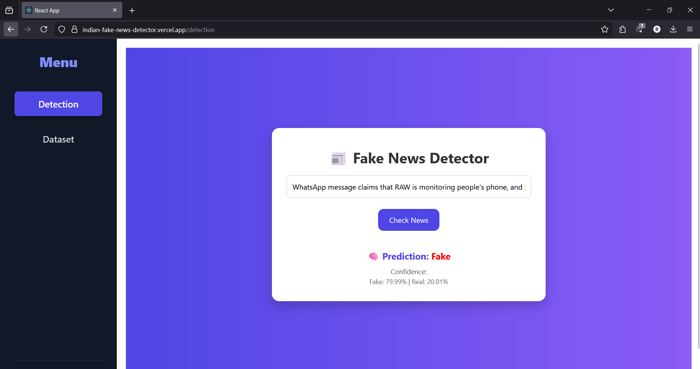
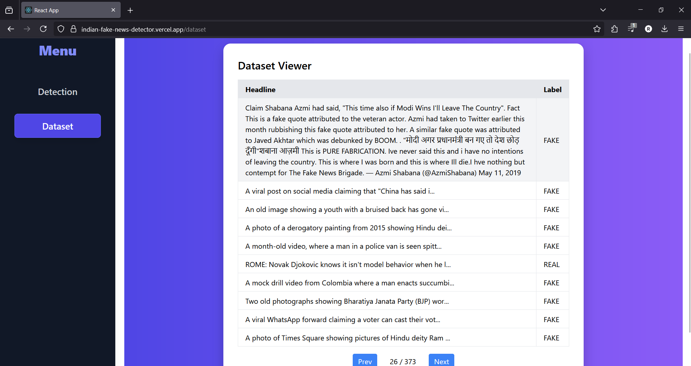

# Indian Fake News Detector Web App

This is a full-stack web application that classifies Indian news headlines as Real or Fake using a Logistic Regression model trained on TF-IDF vectors of Indian news data. It features a React frontend for user interaction and a Flask backend powered by a machine learning model for prediction.

## Live Demo

Experience the live application:

* **Frontend (User Interface):** [indian-fake-news-detector.vercel.app](https://indian-fake-news-detector.vercel.app)
* **Backend (API Endpoint):** [indian-fake-news-detector.up.railway.app](https://indian-fake-news-detector.up.railway.app)

## Screenshots

To give you an idea of how the app works, here are some screenshots of the interface and predictions:

### Detection Page


### Dataset Viewer



## Features

* Detects fake/real news headlines using a pre-trained machine learning model.
* Provides confidence scores for predictions (e.g., "Fake: 95.23%", "Real: 4.77%").
* Interactive and responsive user interface built with React.js and Tailwind CSS.
* Displays a "Dataset Viewer" page for exploring the dataset of news headlines on which the model was trained.

## Technologies Used

This project leverages a modern full-stack architecture:

### Frontend
* **Framework:** React.js (created with Create React App)
* **Styling:** Tailwind CSS
* **CSV Parsing:** Papaparse
* **Package Manager:** npm

### Backend
* **Framework:** Flask (Python)
* **Data Handling:** Pandas
* **Machine Learning:** Scikit-learn (Logistic Regression, TfidfVectorizer)
* **Model Serialization:** Pickle
* **WSGI Server:** Gunicorn
* **CORS Handling:** Flask-CORS
* **API Testing:** Postman
* **Package Manager:** pip

### Data Source
* **Dataset:** [Fake and Real News Dataset on Kaggle](https://www.kaggle.com/datasets/imbikramsaha/fake-real-news/data)
    *(The processed `news_dataset.csv` is included in the `backend/` directory.)*

### Deployment & Version Control
* **Frontend Hosting:** Vercel
* **Backend Hosting:** Railway
* **Version Control:** Git
* **Repository Hosting:** GitHub

## Local Setup and Installation

To run this project on your local machine for development, follow these steps:

### 1. Clone the repository

First, clone the project from GitHub and navigate into the main directory:

```bash
git clone https://github.com/rahilpatel1809/indian-fake-news-detector.git
cd indian-fake-news-detector
```

### 2. Backend Setup

Navigate to the backend directory, set up a virtual environment, install dependencies, ensure the dataset is present, train the model, and start the server.
```bash
cd backend
```

Create and Activate Virtual Environment (Recommended):
#### On Windows:
```
python -m venv venv
.\venv\Scripts\activate
```
#### On macOS/Linux:
```
python3 -m venv venv
source venv/bin/activate
```

Install Backend Dependencies:
```
pip install -r requirements.txt
```

### Ensure Dataset is Present:
Make sure the news_dataset.csv file is present in the `backend/` directory. This file is crucial for train_model.py. If it's not present from the clone, you might need to download it from the Kaggle link provided above and place it in the backend/ folder.

### Train the Machine Learning Model:
This step is crucial as it generates the model.pkl and vectorizer.pkl files that your Flask app needs to load.
```
python train_model.py
```
### Run the Flask Backend Server:
```
# For local development with Flask's built-in server:
python app.py
```
### For a production-like local environment using Gunicorn:
### (Ensure your virtual environment is active and gunicorn is installed)
`gunicorn app:app`

The Flask server will typically run on `http://localhost:5000`.

### 3. Frontend Setup

Open a new terminal window (keep your backend server running in the first terminal) and navigate to the frontend directory. Install dependencies and start the development server.
```
cd ../frontend
```
Install Frontend Dependencies:
```
npm install
```
Start the React Development Server:
```
npm start
```
The React app will typically open automatically in your browser at `http://localhost:3000`.

(Note: When running both frontend and backend locally, ensure your frontend's API calls are pointed to `http://localhost:5000` or whatever port your Flask backend is running on locally. For deployed versions, use the Railway URL.)

⬤ Please do ⭐ the Repository, if it helped you in anyway.

😊 Thankyou !! ✨
